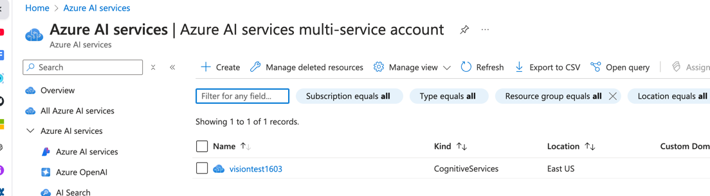
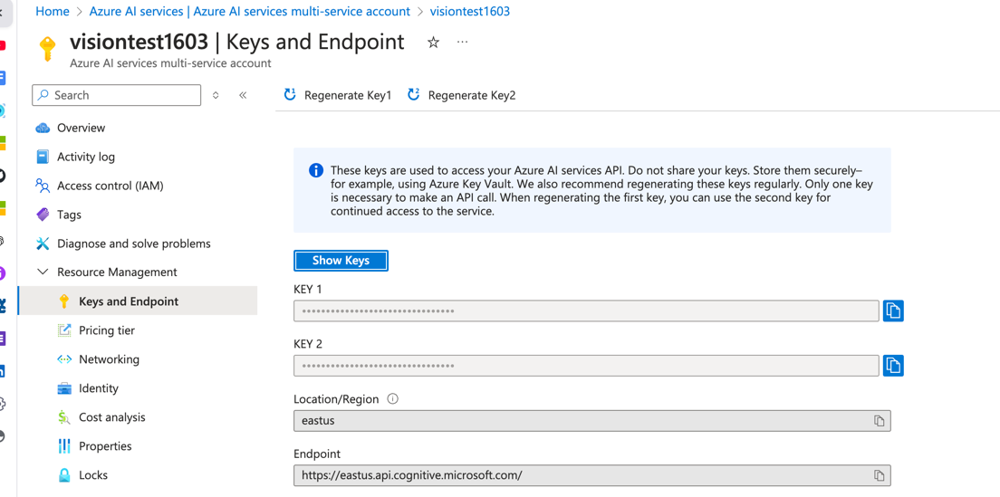

# Azure AI vision -OCR/Image analysis using python SDK

#### The project deals with OCR and image analysis sample using microsoft azure vision service through AI mutli service account.

### *Tech Stack and services*

a) **Azure cloud**
b) **Azure AI services**
c) **Python**
d) **Azure storage account**

## Steps are as followed:

1) Create a storage account and a container inside. Keep the files.
2) Create a SAS token in storage account as we will be using Python SDK by using SAS token
3) We are doing so as blob aren't directly accessible using the URL due to private access 
4) Create a vision service as below:

5) Get the access key of vision service and end point as below.
6) Use the same to connect to you AI service.

7) azureblob.py is to fetch the exact image URL which requires SAS token to develop the URL to be used in image_analysis.py or OCR.PY
To connect to azure blob you need a SAS token which can be generated by going stoage account as below property.

storage account >> security and networking >> sas token >> check object >> generate sas and connection string

8) OCR.py used Azure AI vision service to read text from jpg files while image_analysis.py is used for description of the image.

## **Note: Do not forget to delete the resouces**